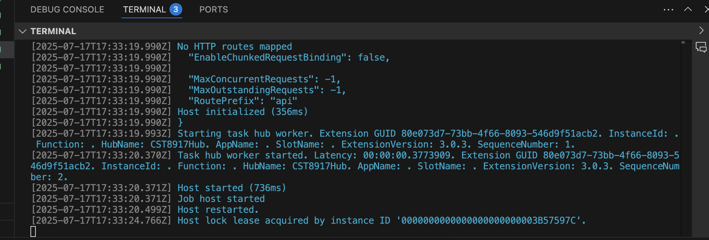
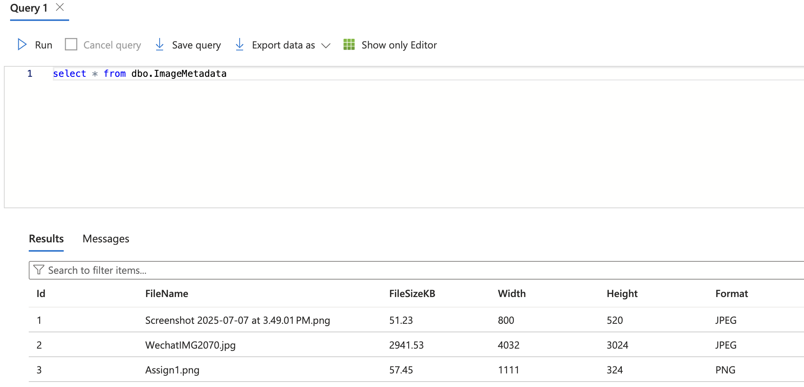

# CST8917 Assignment 1: Durable Workflow for Image Metadata Processing

## 🎯 Objective

This project implements a serverless image metadata processing pipeline using **Azure Durable Functions in Python**. It automatically extracts metadata from images uploaded to Azure Blob Storage and stores the data in an **Azure SQL Database**.

This assignment simulates a real-world event-driven system for a content moderation team.

---

## 📂 Project Structure

```
image-metadata-durable-fn/
├── blob_starter/              # Blob-triggered starter function
│   └── __init__.py
│   └── function.json
├── extract_metadata/          # Activity function: extract image metadata
│   └── __init__.py
│   └── function.json
├── store_metadata/            # Activity function: store metadata in Azure SQL DB
│   └── __init__.py
│   └── function.json
├── orchestrator_function/     # Durable orchestrator function
│   └── __init__.py
│   └── function.json
├── host.json
├── local.settings.json
├── requirements.txt
└── README.md
```

---

## 🧪 How It Works

1. **Trigger**: When a `.png`, `.jpg`, or `.gif` image is uploaded to the Blob container (`images-input`), the `blob_starter` function triggers a new orchestration.

2. **Orchestration Flow** (`orchestrator_function`):
    - Step 1: `extract_metadata` reads the image and extracts:
        - File name
        - File size (in KB)
        - Width and height (in pixels)
        - Image format (e.g., JPEG, PNG)
    - Step 2: `store_metadata` stores the extracted metadata into an Azure SQL Database using output bindings.

---

## ⚙️ Azure Setup

### ✅ Resources Used:

- **Resource Group**: `cst8917-rg`
- **Storage Account**: `cst8917storagesxd`
- **Blob Container**: `images-input`
- **SQL Server**: `cst8917sqlserver`
- **SQL Database**: `cst8917db`
- **SQL Table**:

```sql
CREATE TABLE dbo.ImageMetadata (
    Id INT IDENTITY(1,1) PRIMARY KEY,
    FileName NVARCHAR(255),
    FileSizeKB FLOAT,
    Width INT,
    Height INT,
    Format NVARCHAR(50)
);
```

### 🔐 Connection Strings

Stored securely in `local.settings.json` and in Azure Application Settings:

- `AzureWebJobsStorage`
- `SQLConnectionString`

---

## 🚀 Deployment Instructions

1. **Install Azure Functions Core Tools & Python v3.10+**
2. **Clone Repository**
3. **Create a Virtual Environment**

```bash
python -m venv venv
source venv/bin/activate
pip install -r requirements.txt
```

4. **Start Azurite (local blob emulator) or connect to Azure**
```bash
func start
```

---
5. **Verify photo upload and insertion into SQL DB result:**


## 📹 Demo Vi

🔗 [Watch on YouTube](https://your-youtube-demo-link.com)

> *(Max 5 minutes – Explains architecture, trigger, metadata extraction, SQL insertion, and test run)*

---

## 📌 Notes

- Make sure your SQL firewall allows Azure services.
- Use `az sql db show-connection-string` to get ADO.NET string if needed.
- Durable functions automatically handle retries and orchestration state.

---

## 👨‍💻 Author

**Shaoxian [Your Last Name]**  
Student ID: [Optional]  
Course: CST8917 – Serverless Application Development  
